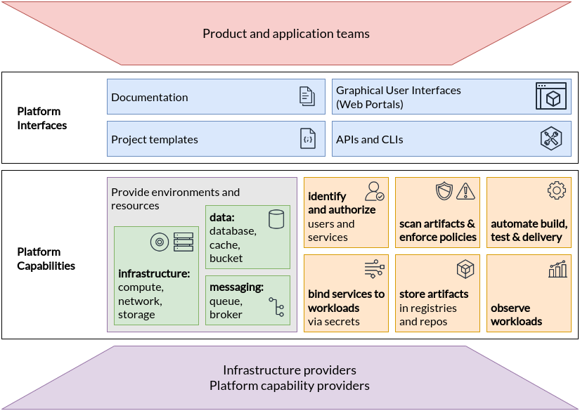

## Introduction

Platform engineering has emerged as a necessary optimization for enterprises that experienced the value of autonomous teams with the emergence of DevOps, but want to reduce the costs, security risks, and inefficiencies that came with that autonomy.
Platforms curate and present foundational capabilities, frameworks, and experiences to facilitate and accelerate the work of internal customers such as application developers, data scientists, and information workers.
Most importantly, platforms help enterprises realize the cloud native values of fast product releases, portability across infrastructure's, and greater developer productivity across their entire technology estate.
Platforms achieve this by codifying what is unique to their business but common across their internal teams, creating an internal economy of scale that their software teams can leverage.

This paper intends to support enterprise leaders, enterprise architects and platform team leaders to advocate for, investigate and plan internal platforms for cloud computing.
We believe platforms significantly impact enterprises' actual value streams, but only indirectly, so leadership consensus and support is vital to the long-term sustainability and success of platform teams.
In this paper we'll enable that support by discussing what the value of platforms is, how to measure that value, and how to implement platform teams that maximize it.

## Table of Contents

1. Why platforms?
1. What is a platform
1. Attributes of successful platforms
1. Attributes of successful platform teams
1. Challenges when implementing platforms
1. How to measure the success of platforms
1. Capabilities of platforms

## Why platforms?

Platforms and platform engineering are popular topics in today's cloud computing world.
Before diving into definitions, techniques, and measurements for platform building, it is important to explore the value platforms provide that's driving this well-deserved attention.

Process improvements over the past 2-3 decades have significantly increased the agility of software application and product teams by offering flexible infrastructure services (such as compute, network and storage) as well as developer services (such as builds, tests, delivery and observability).
The emergence of DevOps practices brought autonomy and process improvement, but it also had the effect of shifting more responsibility for supporting services to product teams, thereby forcing them to spend more time and cognitive energy on infrastructure concerns and reducing their time to produce value relevant to their organization.
In addition, the duplication of operations across teams increases risk due to sprawling implementations and unclear ownership models.

The desire to refocus delivery teams on their core mission and reduce duplication of effort across the organization has motivated enterprises to implement platforms for cloud-native computing. By investing in platforms, enterprises can:

1. Reduce the cognitive load on product teams and thereby accelerate product development and delivery
1. Improve reliability and resiliency of products relying on platform capabilities by dedicating experts to configure and manage them
1. Accelerate product development and delivery by reusing and sharing platform tools and knowledge across many teams in an enterprise
1. Reduce risk of security, regulatory and functional issues in products and services by governing platform capabilities and the users, tools and processes surrounding them
1. Enable cost-effective and productive use of services from public clouds and other managed offerings by enabling delegation of implementations to those providers while maintaining control over user experience

These benefits accrue in part because just a few platform teams serve many product teams, multiplying their impact; in part because platform teams consolidate management of common functionality, facilitating governance; and in part because platform teams emphasize user interfaces and experiences above all else.

A team of platform experts not only reduces common work demanded of product teams but also optimizes platform capabilities used in those products.
A platform team also maintains a set of conventional patterns, knowledge, and tools used broadly across the enterprise; enabling developers to quickly contribute to other teams and products built on the same foundations.
The shared platform patterns also allow embedding governance and controls in on-demand services, patterns and capabilities.
Finally, because platform teams corral providers and provide consistent experiences over their offerings, they enable efficient use of infrastructure and service providers for foundational but undifferentiated capabilities such as databases, identity access, infrastructure operations, and app lifecycle.
By decoupling the underlying implementations from the provided capabilities, a platform also introduces the flexibility to change tools and vendors while maintaining a consistent interface and experience for users.

## What is a platform

A cloud-native computing platform is an integrated collection of capabilities defined and presented to meet the needs of its users.
It is a cross-cutting layer that ensures a consistent experience for acquiring and integrating typical capabilities and services for a broad set of applications and use cases.
A good platform provides a consistent, opinionated user experience for using and managing its capabilities and services, such as Web portals, project templates, and self-service APIs.

According to Atlassian [[1]], "platform teams create capabilities that can be used by numerous stream-aligned [product] teams with little overhead... platform teams minimize resources and cognitive load of the stream-aligned [product] team… platform teams can create a cohesive experience that spans across different user experiences or products."

According to Martin Fowler and Evan Bottcher [[2]], "a digital platform is a foundation of self-service APIs, tools, services, knowledge, and support which are arranged as a compelling internal product. Autonomous delivery teams can make use of the platform to deliver product features at a higher pace, with reduced coordination."

The specific set of capabilities and scenarios supported by a platform should be determined by the needs of stakeholders and users.
And while platforms _provide_ these required capabilities, it's critical to note that platform teams should not always _implement_ them themselves.
Managed service providers or dedicated internal teams can maintain backing implementations, while platforms are the thinnest reasonable layer that provides consistency across provided implementations and meets an organization's requirements.
For example, a very simple "platform" could be a wiki page with links to standard operating procedures to provision capabilities from providers, as described in [[3]].

Because these platforms target no more and no less than an enterprise's internal users, we often refer to them as *internal* platforms.

Platforms are particularly relevant for cloud-native architectures because they separate supporting capabilities from application-specific logic more than previous paradigms.
In cloud-like environments, applications often externalize a lot of their architecture.
This requires resources and capabilities that are often managed independently and integrated with custom business components; such resources may include databases and object stores, message queues and brokers, observability collectors and dashboards, user directories and authentication systems, task runners and reconcilers and more.
An internal platform provides these to enterprise teams in ways that make them easy to integrate in their applications and systems.

### Platform maturity

At their most basic, internal platforms provide consistent experiences for acquiring and using individual capabilities such as a pipeline runner, a database system, or a secret store.
As they mature, internal platforms also offer _compositions_ of these capabilities as self-serviceable assets for key scenarios like web application development or data analysis.

Use cases that an enterprise could meet with platforms might progress through the following:

1. **Provisional \-** Capabilities are built out of necessity by temporary or voluntary staff, leading to erratic adoption, ad hoc operations, and measurement.

1. **Operational \-** A dedicated, budgeted team provides common capabilities, often reactively, with adoption driven by external mandates or incentives, and operations are centrally tracked.

1. **Scalable \-** The platform is treated "As product" with investment based on customer value and staffed by product/UX roles, resulting in users choosing the platform for its intrinsic value (intrinsic pull).

1. **Optimizing \-** The platform becomes an "Enabled Ecosystem" focused on organization-wide efficiency, where core maintainers prioritize enabling specialists to extend capabilities, and adoption is participatory.

For a more detailed vision of platform maturity, please refer to the [Platform Engineering Maturity Model](https://cloudnativeplatforms.com/whitepapers/platform-eng-maturity-model/).

## Attributes of platforms

After defining what a platform is and why an organization might want to build one, let's identify some key attributes that affect the success of a platform.

1. **Platform as a product**. A platform exists to serve the requirements of its users and it should be designed and evolved based on those requirements, similar to any other software products. Platforms should provide the necessary capabilities to support the most common use cases across product teams, and prioritize those over more specific capabilities that are only used by a single team to maximize the value delivered.
1. **User experience**. A platform should offer its capabilities through consistent interfaces and focus on the user experience. Platforms should endeavor to meet their users where they are, acknowledging that users can be human or agentic, which means providing a combination of GUIs, APIs, command-line tools, IDEs, and portals. For example, developers might consume such a capability via the IDE, testers might use a command-line tool, whereas a product owner might use a GUI-based web portal.
1. **Documentation and onboarding**. Documentation is a key aspect of a successful software product. To be able to use a platform's offerings, users require documentation and examples. A platform should be delivered with proper documentation addressing the needs of its users. It should also provide tools to accelerate the onboarding of new projects that can help users consume the necessary platform services in a quick and simple way. For example, the platform could offer a reusable supply chain workflow for building, scanning, testing, deploying, and observing a web application on Kubernetes. Such a workflow could be offered with an initial project template and documentation, a bundle often described as a _golden path_.
1. **Self-service**. A platform should be self-serviceable. Users must be able to request and receive capabilities autonomously and automatically. This property is key to allowing a platform team to enable multiple product teams and scale as needed. The platform capabilities should be available on-demand via the interfaces described above. For example, it should be possible for a user to request a database and receive its locator and credentials by running a command-line tool or filling out a form on a web portal, without waiting for a manual review or approval.
1. **Reduced cognitive load for users**. An essential goal of a platform is to reduce the cognitive load on product teams. A platform should encapsulate implementation details and hide any complexity that might arise from its architecture. For example, a platform might delegate certain services to a cloud provider, but users should not be exposed to such details. At the same time, the platform should allow users to configure and observe certain services as needed. Users must not be responsible for operating the services offered by the platform. For example, users may often require a database, but they shouldn't have to manage the database server.
1. **Optional and composable**. Platforms are intended to make product development more efficient, so they must not be an impediment. A platform should be composable and enable product teams to use only parts of its offerings. It should also enable product teams to provide and manage their own capabilities outside of the platform's offerings when necessary. For example, if a platform doesn't provide a graph database and it's required for a product, it should be possible for the product team to provision and operate a graph database themselves.
1. **Secure and compliant by default**. A platform should be secure by default and offer capabilities to ensure compliance and validation based on rules and standards defined by the organization.
Security, governance, and compliance requirements for the business should be baked into the platform, reducing users' cognitive burden while ensuring consistent enforcement.

## Attributes of platform teams

Platform teams are responsible for the interfaces and user experience of platform capabilities \- like Web portals, custom APIs, and golden paths.
On one hand, platform teams work with those teams implementing infrastructure and supporting services to define consistent experiences; on the other, they work with product and user teams to gather feedback and ensure those experiences meet requirements.

Following are jobs a platform team should be responsible for:

1. Research platform user requirements and plan feature roadmap
1. Market, evangelize and advocate for the platform's proposed values
1. Manage and develop interfaces for using and observing capabilities and services, including portals, APIs, documentation and templates, and CLI tools

Most importantly, platform teams must learn about the requirements of platform users to inform and continuously improve capabilities and interfaces offered by their platform.
Ways to learn about user requirements include user interviews, interactive hackathons, issue trackers and surveys, and direct observation of usage through observability tools.
For example, a platform team could publish a form for users to submit feature requests, lead roadmap meetings to share upcoming features and review users' usage patterns to set priorities.

Inbound feedback and thoughtful design is one side of product delivery; the other side is outbound marketing and advocacy.
If the platform is truly built to user requirements those users will be excited to use the provided capabilities.
Some ways a platform team can enable user adoption is through internal marketing activities including broad announcements, engaging demos, and regular feedback and communication sessions.
The key here is to meet users where they are and bring them on a journey to engage with and benefit from the platform.

A platform team doesn't necessarily run compute, network, storage or other services.
In fact an internal platform should rely on _externally_-provided services and capabilities as much as possible; platform teams should build and maintain their own capabilities only when they're not available elsewhere from managed providers or internal infrastructure teams.
Instead, platform teams are most responsible for the _interfaces_ (i.e., GUI, CLI, and API) and user experiences for the services and capabilities their platform makes available.

For example, a Web page in a platform might describe and even offer a button to provision an identity for an app; while the implementation of that capability might be via a cloud-hosted identity service.
An internal platform team may manage the web page and an API, but not the actual service implementation.
Platform teams should usually consider creating and maintaining their own capabilities only when a required capability is not available elsewhere.

## Challenges with platforms

While platforms promise lots of value, they also bring challenges like the following which implementers should keep in mind.

**The platform is disconnected from the actual needs and wants of the developers**

This is perhaps the easiest route to get lost, and emphasizes why it is important to treat the platform as a customer-facing product and recognize that its success is directly dependent on the success of its users and products.
As such it's vital that platform teams partner with app teams and other users to prioritize, plan, implement and iterate on the platform's capabilities and user experiences.
Platform teams that release features and experiences without feedback or that rely on top-down mandates to achieve adoption are almost certain to find resistance and resentment from their users and miss a lot of the promised value.
To counter this, platform teams should include product managers from the start to share roadmaps, gather feedback and generally understand and represent the needs of platform users.

**Too much effort is spent on low-value solutions that are overfitted to early-adopters**

When creating a platform, choosing the right capabilities and experiences to enable first is crucial.
Capabilities that are frequently required and undifferentiated, like pipelines, databases and observability, may be a good place to start.
Platform teams may also choose to focus first on a limited number of engaged and skillful app teams, who can provide detailed feedback.
While this is valuable for the platform development process, it is important to maintain a bird's-eye view of how the platform should evolve, and manage the roadmap thoughtfully to avoid prioritizing solutions for very narrow use-cases.
Still, these teams should be cherished; if you can engage with the early adopters, include their feedback and give them a feeling of ownership, you will end up with teams that can help champion and evangelize the platform to later adopters.

**Low investment from leadership due to lack of clear impact**

Finally, it's vital in large enterprises to quickly gain leadership support for platform teams.
Many enterprise leaders perceive IT infrastructure as an expense quite disconnected from their primary value streams and may try to constrain costs and resources allocated to IT platforms, leading to a poor implementation, unrealized promises and frustration.
To mitigate this, platform teams need to demonstrate their direct impact on and relationships with product and value stream teams (see the previous two paragraphs), presenting the platform team as a strategic partner of product teams in delivering value to customers.
The following chapter will shed some light on how this can be done.

### Enabling platform teams

It is clear from these challenges that platform teams are faced with a number of diverse responsibilities which lead to cognitive load.
Just as with their application team counterparts, this challenge grows with the number and diversity of users and teams they need to support.

It is important to focus the platform team's energy on the experience and capabilities that are unique to their specific business.
Ways to reduce load on the platform team include the following:

1. Seek to build the thinnest viable platform layer over implementations from managed providers
1. Leverage open source frameworks and toolkits for creating docs, templates and compositions for application team use
1. Ensure platform teams are staffed appropriately for their domain and number of customers

## How to measure the success of platforms

Enterprises will want to measure whether their platform initiatives are delivering the values and attributes discussed above.
Also, throughout this paper we've emphasized the importance of treating internal platforms as products, and good product management depends on quantitative and qualitative measurement of a product's performance.
To meet these requirements, internal platform teams should continuously gather user feedback and measure user activities.

As with other aspects of internal platforms, though, platform teams should use the smallest viable effort to gather the feedback they need.
We'll suggest metrics here but simple surveys and analysis of user behavior may be most valuable initially.

Categories of metrics that will help enterprises and platform teams understand the impact of their platforms include the following:

### User satisfaction and productivity

The first quality sought by many platforms is to improve user experience in order to increase productivity.
Metrics that reflect user satisfaction and productivity include the following:

- Active users and retention: includes number of capabilities provisioned and user growth/churn
- "Net Promoter Score" (NPS) or other surveys that measure user satisfaction with a product
- Metrics for developer productivity such as those discussed in the SPACE framework [[4]]

### Organizational efficiency

Another benefit sought from many platforms is to efficiently provide common needs to a large user base.
This is often achieved by enabling user self-service and reducing manual steps and required human intervention while implementing policies to guarantee safety and compliance.
To measure the efficiency of a platform in reducing common work, consider measures such as these:

- Latency from request to fulfillment of a service or capability, such as a database or test environment
- Latency to build and deploy a brand new service into production
- Time for a new user to submit their first code changes to their product

### Product and feature delivery

The ultimate objective of internal platforms is to deliver business value to customers faster, so measuring impact on a business's own product and feature releases demonstrates that the objectives of the platform are being met.
The DevOps Research and Assessment (DORA) institute at Google suggests [[5]] tracking the following metrics:

- Deployment frequency
- Lead time for changes
- Time to restore services after failure
- Change failure rate

Generally, a key objective of platform teams is to align infrastructure and other IT capabilities with an enterprise's value streams - its products.
And so ultimately the success of an organization's products and applications are the true measure of the success of a platform.

## Capabilities of platforms

As we've described, a platform for cloud-native computing offers and composes capabilities and services from many supporting providers.
These providers may be other teams within the same enterprise or third parties like cloud service providers.
In a nutshell, platforms bridge from underlying _capability providers_ to platform users like application developers; and in the process implement and enforce desired practices for security, performance, cost governance and consistent experience.
The following graphic illustrates the relationships between products, platforms, and capability providers.

We've focused in this paper on how to construct a good platform and platform team; now in this last section we'll describe the capabilities a platform may actually offer.
This list is intended to guide platform builders and includes capabilities typically required by cloud-native applications.
As we've noted throughout though, a good platform reflects its users' needs, so ultimately platform teams should choose and prioritize the capabilities their platform offers together with its users.

Capabilities may comprise several _features_, meaning aspects or attributes of the parent capability's domain.
For example, observability may include features for gathering and publishing metrics, traces and logs as well as for observing costs and energy consumption.
Consider the need and priority for each feature or aspect in your organization.
Later CNCF publications may expand on each domain further.

Here are capability domains to consider when building platforms for cloud-native computing:

1. **Web portals** for observing and provisioning products and capabilities
1. **APIs** (and CLIs) for automatically provisioning products and capabilities
1. **"Golden path" templates and docs** enabling optimal use of capabilities in products
1. **Automation for building and testing** services and products
1. **Automation for delivering and verifying** services and products
1. **Development environments** such as hosted IDEs and remote connection tools
1. **Observability** for services and products using instrumentation and dashboards, including observation of functionality, performance and costs
1. **Infrastructure** services including compute runtimes, programmable networks, and block and volume storage
1. **Data** services including databases, caches, and object stores
1. **Messaging** and event services including brokers, queues, and event fabrics
1. **Identity and secret** management services such as service and user identity and authorization, certificate and key issuance, and static secret storage
1. **Security** services including static analysis of code and artifacts, runtime analysis, and policy enforcement
1. **Artifact storage** including storage of container image and language-specific packages, custom binaries and libraries, and source code

The following table is intended to help readers grasp each capability by loosely relating it to existing CNCF or CDF projects.

| Capability | Description | Example CNCF/CDF Projects |
| :---- | :---- | :---- |
| Web portals for provisioning and observing capabilities | Publish documentation and service catalogs. Publish telemetry about systems and capabilities. | Backstage, Skooner, Ortelius |
| APIs for automatically provisioning capabilities | Structured formats for automatically creating, updating, deleting and observing capabilities. | Kubernetes, Crossplane, Operator Framework, Helm, KubeVela |
| Golden path templates and docs | Templated compositions of well-integrated code and capabilities for rapid project development. | ArtifactHub |
| Automation for building and testing products | Automate build and test of digital products and services. | Tekton, Jenkins, Buildpacks, ko, Carvel |
| Automation for delivering and verifying services | Automate and observe delivery of services. | Argo, Flux, Keptn, Flagger, OpenFeature |
| Development environments | Enable research and development of applications and systems. | Devfile, Nocalhost, Telepresence, DevSpace |
| Application observability | Instrument applications, gather and analyze telemetry and publish info to stakeholders. | OpenTelemetry, Jaeger, Prometheus, Thanos, Fluentd, Grafana, OpenCost |
| Infrastructure services | Run application code, connect application components and persist data for applications | Kubernetes, Kubevirt, Knative, WasmEdge, KEDA CNI, Istio, Cilium, Envoy, Linkerd, CoreDNS Rook, Longhorn, Etcd |
| Data services | Persist structured data for applications | TiKV, Vitess, SchemaHero |
| Messaging and event services | Enable applications to communicate with each other asynchronously | Strimzi, NATS, gRPC, Knative, Dapr |
| Identity and secret services | Ensure workloads have locators and secrets to use resources and capabilities. Enable services to identify themselves to other services | Keycloak, Dex, External Secrets, SPIFFE/SPIRE, Teller, cert-manager |
| Security services | Observe runtime behavior and report/remediate anomalies. Verify builds and artifacts don't contain vulnerabilities. Constrain activities on the platform per enterprise requirements; notify and/or remediate aberrations | Falco, In-toto, KubeArmor, OPA, Kyverno, Cloud Custodian |
| Artifact storage | Store, publish and secure built artifacts for use in production. Cache and analyze third-party artifacts. Store source code. | ArtifactHub, Harbor, Distribution, Porter |
## Glossary

See also <https://glossary.cncf.io/>.

A **platform** aggregates capabilities to serve developers and operators in development and delivery of products, services and apps.
In reference to the scenarios it aims to support, a platform may be named a "Developer Platform", a "Delivery Platform", an "App Platform" or even a "Cloud Platform."
The connotations of the older term "Platform-as-a-Service", or PaaS, are also influential.

**Platforms** enable developers and operators to deliver applications and services faster by providing and managing common capabilities.
Platforms bridge between platform users and platform capability providers, and are built and maintained by platform teams.

**Platform capability providers** develop and maintain the capabilities offered by the platform.
Providers can be both external organizations or internal teams, and capabilities can be infrastructure, runtime, or other supporting services.

**Platform engineers** are responsible for developing and maintaining interfaces and tools to enable provisioning and integration of platform capabilities in applications, according to the requirements and instructions provided by platform product managers.
Platform developers are usually grouped in platform teams.

**Platform product managers** are responsible for understanding the experience of platform users, building a roadmap that addresses platform product gaps, requirements, and opportunities, and managing platform teams in their daily work.

**Platform teams** are responsible for developing and maintaining the interfaces to and experiences with platform capabilities - like Web portals, custom APIs, and golden path templates.
Platform teams are managed by platform product managers and involve platform developers.
As the platform evolves and become more advanced, other roles can become part of a platform team, including, but not limited to, operators, QA analysts, UI/UX designers, technical writers, developer advocates.

**Platform users** include but aren't limited to app developers and operators, data scientists, COTS software operators, and information workers - whoever runs software on the platform or uses platform provided capabilities.

**Thinnest viable platform (TVP)** is a concept originally defined in the book *Team Topologies* by Matthew Skelton and Manuel Pais.
The definition says: "A TVP is a careful balance between keeping the platform small and ensuring that the platform is helping to accelerate and simplify software delivery for teams building on the platform."

<!-- ## Footnotes -->

[1]: https://www.atlassian.com/devops/frameworks/team-topologies
[2]: https://martinfowler.com/articles/talk-about-platforms.html
[3]: https://teamtopologies.com/key-concepts-content/what-is-a-thinnest-viable-platform-tvp
[4]: https://queue.acm.org/detail.cfm?id=3454124
[5]: https://cloud.google.com/blog/products/devops-sre/the-2019-accelerate-state-of-devops-elite-performance-productivity-and-scaling
