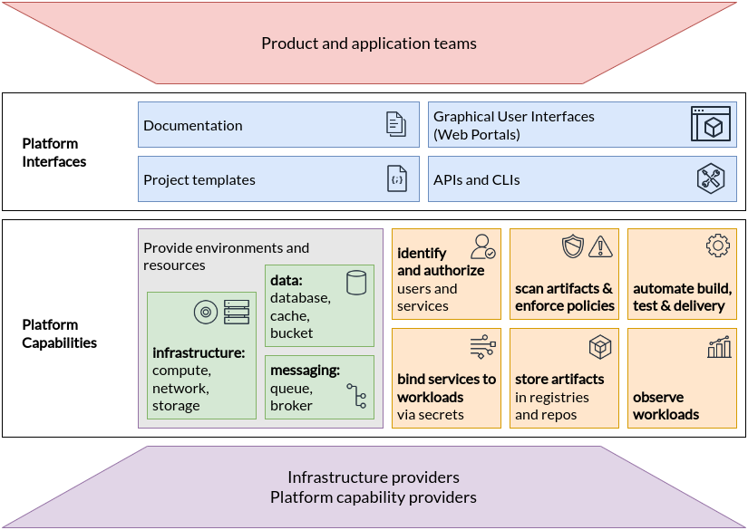

## イントロダクション

プラットフォームエンジニアリングは、DevOpsの台頭により自律的なチームの価値を実感しつつも、その自律性に伴うコスト、セキュリティリスク、非効率性を低減したいと考える企業にとって、不可欠な最適化策として登場しました。
プラットフォームは、アプリケーション開発者、データサイエンティスト、インフォメーションワーカーなど、内部顧客の作業を促進し、加速するために、基盤となる能力、フレームワーク、エクスペリエンスを選定・整備して提供します。
最も重要な点として、プラットフォームは、迅速な製品リリース、インフラストラクチャ間の移植性、そしてテクノロジー資産全体にわたる開発者の生産性向上という、クラウドネイティブの価値を企業が実現するのを支援します。
プラットフォームは、各組織に固有でありながら組織内の複数チームで共通する仕組みを体系化することで、組織内のスケールメリットを生み出します。これにより、ソフトウェアチームはプラットフォームを効率的に活用できるようになります。

この文書は、エンタープライズのリーダー、エンタープライズアーキテクト、およびプラットフォームチームのリーダーが、クラウドコンピューティングのための内部プラットフォームの提唱、調査、計画をサポートすることを目的としています。
私たちは、プラットフォームが企業の実際のバリューストリームに大きな影響を与えると信じていますが、それは間接的なものなので、プラットフォームチームの長期的な持続と成功にはリーダーシップの合意と支援が不可欠です。
この文書では、プラットフォームの価値が何であるか、それをどのように測定するか、そしてそれを最大化するプラットフォームチームをどのように実現するかについて議論することで、その支援を促進します。

## 目次

1. なぜプラットフォームなのか?
1. プラットフォームとはなにか？
1. 成功するプラットフォームの特徴
1. 成功するプラットフォーム・チームの特徴
1. プラットフォームを導入する時の課題
1. プラットフォームの成功をどう測定するか
1. プラットフォームの能力

## なぜプラットフォームなのか?

今日のクラウドコンピューティングの世界において、プラットフォームとプラットフォームエンジニアリングは注目を集めている話題です。
プラットフォーム構築の定義、テクニック、測定方法について掘り下げる前に、まずプラットフォームがもたらす価値について考察することが重要です。

過去20～30年間にわたるプロセスの改善により、柔軟なインフラストラクチャサービス（コンピューティング、ネットワーク、ストレージなど）や開発者向けサービス（ビルド、テスト、デリバリー、可観測性など）が提供されるようになり、ソフトウェアアプリケーションおよびプロダクトチームの俊敏性が大幅に向上しました。
DevOpsの登場により、自律性の向上やプロセス改善が進んだが、その一方、インフラチームの責務の多くがプロダクトチームに移ることにもなりました。その結果、プロダクトチームはインフラ対応に多くの時間を割き、認知負荷も増大したことで、組織に価値をもたらす成果の創出に十分な時間を充てられなくなりました。
さらに、チーム間で運用業務が重複することで、実装が乱立し、責任の所在が不明確になるため、リスクが高まります。

デリバリーチームを本来のコアミッションに集中させ、組織全体の重複作業を減らしたいという要望から、企業はクラウドネイティブコンピューティング向けのプラットフォームを導入するようになりました。プラットフォームに投資することで、企業は次のことが可能になります：

1. プロダクトチームの認知負荷を軽減し、プロダクト開発とデリバリーを加速します。
1. プラットフォーム能力を構成・管理する専門家を配置することで、彼らに依存する製品の信頼性と回復力を向上させます。
1. 企業内の多くのチームでプラットフォームツールやナレッジを再利用・共有することで、プロダクト開発とデリバリーを加速します。
1. プラットフォーム能力、ユーザー、ツール、プロセスを統制することで、製品とサービスにおけるセキュリティ、規制、機能面のリスクを軽減します。
1. ユーザーエクスペリエンスの制御を維持しながら、パブリッククラウドやその他のマネージドサービスプロバイダーへの実装の委譲を可能にすることで、コスト効率と生産性の高いサービスの利用を可能にします。

これらの利点は、わずか数人のプラットフォームチームが多くのプロダクトチームにサービスを提供しその影響力を倍増させるため、またプラットフォームチームが共通機能の管理を統合しガバナンスを促進するため、そしてプラットフォームチームがユーザーインターフェースとエクスペリエンスを何よりも重視するため、といった理由もあります。

プラットフォームの専門家からなるチームは、プロダクトチームに要求される共通作業を減らすだけでなく、それらの製品で使用されるプラットフォーム能力を最適化します。
また、プラットフォームチームは、企業全体で広く使用されている従来のパターン、知識、ツールのセットを維持することで、開発者が同じ基盤上に構築された他のチームや製品に迅速に貢献できるようにします。
さらに、共有プラットフォームのパターンによって、オンデマンドサービス、パターン、能力にガバナンスとコントロールを組み込むことができます。
最後に、プラットフォームチームはプロバイダーをまとめ、プロバイダーが提供するサービスに対して一貫したエクスペリエンスを提供するため、データベース、アイデンティティのアクセス、インフラストラクチャーの運用、アプリのライフサイクルなど、基本的だが差別化されていない能力に対して、インフラストラクチャやサービスプロバイダーを効率的に利用することができます。
基盤となる実装と提供される機能を切り離すことで、プラットフォームは、ユーザーに対して一貫したインターフェースとエクスペリエンスを維持しつつ、ツールやベンダーを変更できる柔軟性も提供します。

## プラットフォームとはなにか？

クラウドネイティブコンピューティングプラットフォームとは、ユーザーのニーズを満たすために定義され、提供される一連の統合された機能群のことです。
これは、幅広いアプリケーションやユースケースに対して、一般的な能力やサービスの取得と統合を一貫したエクスペリエンスで保証する横断的なレイヤーです。
優れたプラットフォームとは、Webポータル、プロジェクトテンプレート、セルフサービスAPIなどの機能やサービスを利用・管理する際、一貫性があり、明確な指針に基づいたユーザー体験を提供するものです。

Atlassianによると[[1]]、「プラットフォームチームは、少しのオーバーヘッドで多数のストリームアラインド[プロダクト]チームが利用できる能力を作成します... プラットフォームチームは、ストリームアラインド[プロダクト]チームのリソースと認知負荷を最小化します... プラットフォームチームは、異なるユーザーエクスペリエンスや製品にまたがる一貫した体験を構築できます。」

マーティン・ファウラーとエバン・ボッチャー[[2]]によると、「デジタルプラットフォームとは、魅力的な社内製品として構成されたセルフサービスAPI、ツール、サービス、知識、サポートの基盤です。自律的なデリバリーチームは、このプラットフォームを活用することで、調整の手間を省き、より迅速に製品機能をリリースすることができます。」

プラットフォームがサポートする具体的な能力やシナリオは、利害関係者やユーザーのニーズによって決定されるべきです。
そして、プラットフォームはこれらの必要な能力を _提供します_ が、プラットフォームチームがいつもそれらを _実装する_ 必要はないことに留意することが重要です。
マネージドサービスプロバイダーや社内の専門チームがバックエンドの実装を維持する一方で、プラットフォームは、提供される実装全体に一貫性を提供し、組織の要件を満たす合理的な最も薄い層です。
例えば、非常にシンプルな「プラットフォーム」は、[[3]]で説明されているように、プロバイダーから能力を提供するための標準作業手順へのリンクが記載されたwikiページである可能性があります。

これらのプラットフォームは企業の内部ユーザーのみを対象としているため、私たちはしばしばそれらを *内部*プラットフォームと呼んでいます。

プラットフォームは、特にクラウドネイティブアーキテクチャにとって重要です。なぜなら、それらは従来のパラダイムよりも、アプリケーション固有のロジックからサポート能力を分離するからです。
クラウドのような環境では、アプリケーションはそのアーキテクチャの多くを外部化することがよくあります。
これには、多くの場合、個別に管理され、独自のビジネスコンポーネントと統合されるリソースや機能が必要となります。こうしたリソースには、データベースやオブジェクトストア、メッセージキューやブローカー、可観測性データ収集ツールやダッシュボード、ユーザーディレクトリや認証システム、タスクランナーやリコンサイラー(差分検出器)などが含まれます。
内部プラットフォームは、エンタープライズチームがこれらのリソースを自社のアプリケーションやシステムに容易に統合できるよう提供します。

### プラットフォームの成熟度

最も基本的なレベルでは、社内プラットフォームは、パイプラインランナー、データベースシステム、シークレットストアといった個々の機能を取得・利用するための一貫した体験を提供します。
成熟するにつれ、内部プラットフォームは、Webアプリケーション開発やデータ分析といった主要なシナリオにおいて、これらの機能を _組み合わせたもの_ をセルフサービス可能な資産として提供します。

企業がプラットフォームを活用して対応できるユースケースは、次のような段階を経て発展する可能性があります：

1. **暫定的である \-** 必要に迫られて、一時的な担当者や有志によって機能が構築されます。そのため、導入状況は安定せず、運用や測定も場当たり的になりがちです。

1. **戦略的である \-** 専任の予算とチームを持つ体制が整い、共通機能が提供され、運用状況は中央集権的に管理されるようになります。ただし、多くの場合は課題発生後の対応が中心であり、ユーザーは組織からの指示やインセンティブによってプラットフォームを導入します。

1. **スケーラブルである \-** プラットフォームが「製品」として扱われるようになり、顧客価値に基づいた投資や、プロダクト／UX担当者の配置が行われます。その結果、ユーザーは強制ではなく、プラットフォームそのものの価値を理由に導入を選択するようになります。

1. **最適化している \-** プラットフォームは、組織全体の効率化を支える「参加型エコシステム」へと発展します。プラットフォームのコアメンテナーは、各分野の専門家が機能を拡張できるよう支援することを重視し、利用者自身もプラットフォームの発展に参加する形で導入と活用が広がっていきます。

プラットフォームの成熟度に関するより詳細なビジョンについては、[プラットフォームエンジニアリング成熟度モデル](https://cloudnativeplatforms.com/whitepapers/platform-eng-maturity-model/)を参照してください。

## プラットフォームの特性

プラットフォームとは何か、そしてなぜ組織がプラットフォームを構築したいと考えるのかを定義したので、プラットフォームの成功に影響を与える主な要素をいくつか特定してみましょう。

1. **製品としてのプラットフォーム**。プラットフォームはユーザーの要求に応えるために存在し、他のソフトウェア製品と同様に、その要求に基づいて設計・進化していくべきものです。プラットフォームは、プロダクトチーム全体で最も一般的なユースケースをサポートするために必要な能力を提供し、特定のチームのみが使用する具体的な能力よりも優先すべきです。そうすることで、提供される価値を最大化することができます。
1. **ユーザーエクスペリエンス**。プラットフォームは、一貫性のあるインターフェースを通じてその能力を提供し、ユーザーエクスペリエンスに重点を置くべきです。プラットフォームは、ユーザーが人間である場合もエージェントである場合もあることを認識し、ユーザーの状況に合わせて対応するよう努めるべきです。つまり、GUI、API、コマンドラインツール、IDE、ポータルを組み合わせる必要があります。例えば、開発者はIDEを通じてその能力を利用し、テスターはコマンドラインツールを使用するのに対して、プロダクトオーナーはGUIベースのWebポータルを利用する場合があります。
1. **ドキュメントと導入**。 ドキュメントは、ソフトウェア製品の成功に欠かせない要素です。プラットフォームから提供されるものを十分に活用するには、ユーザーにドキュメントとサンプルを提供する必要があります。プラットフォームは、ユーザーのニーズに応える適切なドキュメントとともに提供すべきです。また、ユーザーがプラットフォームのサービスを迅速かつ簡単に利用できるように、新規プロジェクトの導入を加速するツールも提供すべきです。例えば、Kubernetes上でウェブアプリケーションを構築、スキャン、テスト、デプロイ、監視するための再利用可能なサプライチェーンワークフローをプラットフォームが提供できます。このようなワークフローは、初期プロジェクトテンプレートとドキュメントとともに提供され、しばしば _ゴールデンパス_ と呼ばれるバンドルとして提供されます。
1. **セルフサービス**。プラットフォームはセルフサービスであるべきです。ユーザーは、自律的かつ自動的に能力を要求し、受け取ることができる必要があります。この特性は、プラットフォームチームが、複数のプロダクトチームが立ち上がることを可能にし、必要に応じて拡張できるようにするための鍵となります。プラットフォームの能力は、上記のインターフェースを介して、必要に応じて利用でき、手動の介入を最小限に抑えることができるべきです。例えば、ユーザーは、手動による審査や承認を待つことなく、コマンドラインツールを実行するか、Webポータル上のフォームに入力するだけで、データベースをリクエストし、そのロケーターと認証情報を受け取ることができるようにすべきです。
1. **ユーザーの認知負荷を軽減**。プラットフォームの重要な目標は、プロダクトチームにおける認知負荷を軽減することです。プラットフォームは実装の詳細をカプセル化し、そのアーキテクチャから生じる可能性のあるあらゆる複雑性を隠蔽すべきです。例えば、プラットフォームは特定のサービスをクラウドプロバイダーに委託する場合がありますが、ユーザーはそうした詳細を一切知らされることはありません。同時に、プラットフォームは、必要に応じてユーザーが特定のサービスを設定し、監視できるようにすべきです。プラットフォームが提供するサービスの運用は、ユーザーの責任ではありません。例えば、ユーザーはデータベースを必要とすることが多いかもしれませんが、データベースサーバーを管理する必要はありません。
1. **オプションで組み合わせ可能**。プラットフォームはプロダクト開発をより効率的にすることを目的としているため、障害となってはいけません。プラットフォームは組み合わせ可能で、提供される機能の一部のみをプロダクトチームが使用できるようにする必要があります。また、必要に応じてプロダクトチームがプラットフォームが提供する能力以外の独自の能力を提供し、管理できるようにする必要があります。例えば、プラットフォームにグラフデータベースが含まれておらず、製品にグラフデータベースが必要であれば、プロダクトチームがグラフデータベースを独自に準備し、運用できるようにすべきです。
1. **デフォルトで安全かつコンプライアンス対応**。プラットフォームはデフォルトで安全であるべきであり、組織が定義したルールや基準に基づいてコンプライアンスと検証を確保するための機能を提供する必要があります。
ビジネスにおけるセキュリティ、ガバナンス、およびコンプライアンスの要件はプラットフォームに組み込まれており、一貫した適用を確保しつつ、ユーザーの認知的負荷を軽減する必要があります。

## プラットフォームチームの特性

プラットフォームチームは、Webポータル、カスタムAPI、ゴールデンパスといったプラットフォーム機能のインターフェースおよびユーザーエクスペリエンスを担当しています。
一方では、インフラストラクチャーやサポートサービスを提供するチームと協力し、一貫した体験を実現します。他方では、プロダクトチームやユーザーチームと協力し、フィードバックを集め、それらの体験が要件を満たしていることを確認します。

プラットフォームチームが担当すべき業務は以下のとおりです：

1. プラットフォームユーザーの要件を調査し、機能ロードマップを計画する。
1. プラットフォームの提案する価値を市場に売り込み、支持を得る。
1. ポータル、API、ドキュメント、テンプレート、CLIツールなど、能力やサービスを利用および監視するためのインターフェースの管理と開発をする。

最も重要なのは、プラットフォームチームはプラットフォームユーザーの要件を把握し、そのプラットフォームが提供する能力やインターフェースの改善を継続的に行う必要があるということです。
ユーザー要件を把握する方法としては、ユーザーインタビュー、インタラクティブなハッカソン、イシュートラッカーやサーベイ、可視化ツールによる直接的な利用状況の観察などがあります。
例えば、プラットフォームチームは、ユーザーが機能リクエストを送信するためのフォームを公開したり、今後の機能について共有するためのロードマップ会議を主導したり、ユーザーの利用パターンを確認して優先順位を設定したりすることができます。

インバウンドのフィードバックと配慮されたデザインは、製品提供の一側面です。もう一方はアウトバウンドのマーケティングと支援です。
プラットフォームが本当にユーザーの要件に合わせて構築されている場合、ユーザーは提供される能力を使用することに興奮を覚えるでしょう。
プラットフォームチームがユーザーに受け入れられるようにする方法はいくつかありますが、その1つは、社内マーケティング活動を通じて、幅広い告知、魅力的なデモ、定期的なフィードバックとコミュニケーションセッションを行うことです。
ここで重要なのは、ユーザーの現状を把握し、プラットフォームに関わり、その恩恵を受けるための旅にユーザーを連れていくことです。

プラットフォームチームは、必ずしもコンピューティング、ネットワーク、ストレージ、その他のサービスを運用しているわけではありません。
実際、内部プラットフォームは、可能な限り _外部から_ 提供されるサービスや能力に頼るべきです。プラットフォームチームは、管理プロバイダーや社内インフラチームから利用できない場合にのみ、独自の能力を構築し、維持すべきです。
その代わりに、プラットフォームチームは、プラットフォームが提供するサービスや能力に対する _インターフェース_（GUI、CLI、APIなど）とユーザーエクスペリエンスに最も責任があります。

例えば、プラットフォーム内のウェブページでは、アプリ用のアイデンティティをプロビジョニングするボタンが説明され提供している場合があります。その機能の実装は、クラウドホスト型のアイデンティティサービスを介して行われる場合もあります。
内部プラットフォームチームでは、WebページとAPIを管理することはあっても、実際のサービス実装は管理しません。
プラットフォームチームは、必要な能力が他では利用できない場合にのみ、独自の能力を作成および維持することを検討すべきです。

## プラットフォームの課題

プラットフォームには多くの価値が約束されていますが、実装者は以下の課題についても留意する必要があります。

**プラットフォームは、開発者の実際のニーズや要望から乖離している**

これはおそらく、方向性を失う最も簡単な道であり、プラットフォームを顧客向け製品として扱い、その成功がユーザーや製品の成功に直結していることを認識することがいかに重要かを浮き彫りにしています。
したがって、プラットフォームチームがアプリチームやその他のユーザーと連携し、プラットフォームの機能やユーザー体験について優先順位付け、計画、実装、そして改善を繰り返していくことが不可欠です。
フィードバックを得ずに機能や体験をリリースしたり、トップダウンで指示を出して普及を図るプラットフォームチームは、ユーザーからの抵抗や不満に直面し、約束された価値の多くを見失うことになるでしょう。
これを防ぐには、プラットフォームチームは初期段階からプロダクトマネージャーをチームに加え、ロードマップを共有し、フィードバックを収集するとともに、プラットフォームユーザーのニーズを深く理解し、それに共感する姿勢を持つ必要があります。

**アーリーアダプター向けに過度に最適化された、価値の低いソリューションに労力を費やしすぎている**

プラットフォームを構築する際、最初に実装すべき機能や体験を適切に選択することが極めて重要です。
パイプライン、データベース、可観測性など、頻繁に必要とされ、かつ差別化要素の少ない機能は、着手点として適しているでしょう。
また、プラットフォームチームは、詳細なフィードバックを提供できる、熱心で熟練したアプリチームを限定的に選び、まずそれらに注力するという選択肢もあります。
これはプラットフォーム開発プロセスにとって有益ですが、プラットフォームがどのように進化すべきかという全体像を常に把握し、非常に限定的なユースケース向けのソリューションを優先しないよう、ロードマップを慎重に管理することが重要です。
とはいえ、こうしたチームは大切にすべきです。アーリーアダプターと積極的に関わり、フィードバックを取り入れ、主体的に関与してもらうことで、後発のユーザーへの導入を後押しする支援者や推進役を育てることができます。

**明確なインパクトの欠如による経営陣からの投資不足**

最後に、大規模な組織では、プラットフォームチームに対する経営層の支援を早期に得ることが極めて重要です。
多くの企業リーダーは、ITインフラを本来の価値の流れとはかけ離れた費用として認識し、ITプラットフォームに割り当てられるコストやリソースを制限しようとするかもしれません。その結果、実装が不十分になったり、期待通りの成果が得られなかったりして、不満を招くことになります。
これを軽減するために、プラットフォームチームは、プロダクトチームやバリューストリームチームに対してどのような直接的な価値をもたらしているのか、また両者の目標とどのように整合しているのかを示す必要があります（前の2つの段落を参照）。プラットフォームチームは、顧客価値を提供するプロダクトチームの戦略的パートナーとして自らを位置付けるべきです。
次の章では、その方法について解説します。

### プラットフォームチームの実現

これらの課題から明らかなように、プラットフォームチームは認知負荷につながるさまざまな責任に直面しています。
アプリケーションチームと同様、この課題はサポートが必要なユーザーやチームの数や多様性に応じて大きくなります。

プラットフォームチームのエネルギーを、具体的なビジネスに固有の能力と体験に集中させることが重要です。
プラットフォームチームの負担を軽減する方法には、次のようなものがあります。

1. マネージドプロバイダーによる実装の上に、最も薄い実行可能なプラットフォーム層(Thinnest Viable Platform)を構築することを目指します。
1. アプリケーションチーム用のドキュメント、テンプレート、コンポジションを作成するためにオープンソースのフレームワークやツールキットを活用します。
1. プラットフォームチームは、担当領域と顧客数に応じて適切な人員を配置します。

## プラットフォームの成功をどう測定するか

企業は、自社のプラットフォームの取り組みが、上で述べたような価値や特性を提供できているかどうかを測りたいと考えるでしょう。
また、この文書では、内部プラットフォームを製品として扱うことの重要性を強調してきました。優れた製品管理は、製品のパフォーマンスを定量・定性的に測定することにかかっています。
これらの要件を満たすには、内部プラットフォームチームは継続的にユーザーからのフィードバックを集め、ユーザー活動を測定する必要があります。

しかし、内部プラットフォームの他の側面と同様、プラットフォームチームは必要なフィードバックを集めるために、最小限の労力で対応すべきです。
ここでは指標を提案しますが、最初はシンプルなサーベイやユーザー行動の分析が最も有益かもしれません。

企業およびプラットフォームチームが自社のプラットフォームの影響を理解するのに役立つ指標のカテゴリーには、以下のものが含まれます：

### ユーザーの満足度と生産性

多くのプラットフォームがまず求める品質は、生産性を高めるためにユーザーエクスペリエンスを向上させることです。
ユーザー満足度と生産性を反映する指標には、次のようなものがあります：

- アクティブユーザーと定着率：提供されている能力の数とユーザー数の増加/減少を含む。
- 「ネットプロモータースコア（NPS）」またはその他の製品に対するユーザー満足度を測定する調査。
- SPACEフレームワーク[[4]]で説明されているような、開発者の生産性を示す指標。

### 組織の効率性

多くのプラットフォームが求めるもう一つの利点は、共通のニーズを多数のユーザーに効率的に提供することです。
これは、ユーザーによるセルフサービスを可能にし、手動のステップや必要な人的介入を減らし、安全とコンプライアンスを保証するポリシーを導入することで、しばしば達成されます。
共通の作業を削減するプラットフォームの効率性を測定するには、次のような指標を考慮してください：

- データベースやテスト環境などのサービスや能力のリクエストから実行までのレイテンシ。
- まったく新しいサービスを構築し、本番環境に導入するまでのレイテンシ。
- 新規ユーザーが製品に初めてコードの変更を提出するまでの時間。

### 製品および機能の提供

内部プラットフォームの究極的な目的は、組織が顧客にビジネス価値をより早く提供することです。そのため、自社の製品や機能リリースに対する影響を測定することで、プラットフォームの目的が達成されていることが証明されます。
GoogleのDevOps Research and Assessment (DORA) 研究所は、以下の指標を追跡することを推奨[[5]]しています。

- デプロイの頻度
- 変更にかかるリードタイム
- 障害発生後の復旧時間
- 変更障害率

一般的に、プラットフォームチームの主な目的は、インフラストラクチャやその他のITの能力を企業のバリューストリームと整合させることです。
そのため、最終的には、その組織が提供する製品やアプリケーションの成功は、プラットフォームの成功を測る尺度になります。

## プラットフォームの能力

これまで説明してきたように、クラウドネイティブコンピューティングのプラットフォームは、多くのサポートプロバイダーが提供する能力やサービスを組み合わせて提供しています。
これらのプロバイダーは、同じ企業内の別のチームであったり、クラウドサービスプロバイダーのようなサードパーティであったりします。
一言で言えば、プラットフォームは、基盤となる _能力プロバイダー_ から、アプリケーション開発者などのプラットフォームユーザーへと橋渡しをするものであり、その過程でセキュリティ、パフォーマンス、コスト管理、一貫したユーザーエクスペリエンスなど、望ましいプラクティスを実装し、強制します。
次の図は、製品、プラットフォーム、能力プロバイダーの関係を表したものです。

この文書では、優れたプラットフォームとプラットフォームチームの構築方法に焦点を当ててきましたが、最後のセクションでは、プラットフォームが実際に提供できる能力について説明します。
このリストは、プラットフォーム構築者の指針となることを目的としており、クラウドネイティブアプリケーションに一般的に求められる能力が含まれています。
ただし、これまで述べてきたように、優れたプラットフォームはユーザーのニーズを反映したものです。そのため、最終的にはプラットフォームチームが、ユーザーとともにプラットフォームが提供する能力を選択し、優先順位を決定すべきです。

能力は、親能力のドメインの属性や側面である、いくつかの _機能_ で構成される場合があります。
例えば、オブザーバビリティには、メトリクス、トレース、ログの収集と公開機能、およびコストとエネルギー消費の監視機能が含まれる場合があります。
組織内の各機能または側面の必要性および優先度を考慮してください。
CNCFの今後の出版物では、各ドメインについてさらに詳しく説明される可能性があります。

クラウドネイティブコンピューティングのためのプラットフォームを構築する際に考慮すべき能力ドメインは以下のとおりです：

1. 製品や能力を確認し、利用するための **Webポータル**
1. 製品と能力を自動的にプロビジョニングするための **API**（およびCLI）
1. 製品内の能力を最大限に活用できる **「ゴールデンパス」テンプレートおよびドキュメント**
1. サービスおよび製品の **構築とテストの自動化**
1. サービスおよび製品の **提供と検証の自動化**
1. ホスト型統合開発環境やリモート接続ツールなどの **開発環境**
1. 機能、パフォーマンス、コストの監視を含むインストゥルメンテーションツールやダッシュボードを使用したサービスや製品の **オブザーバビリティ**
1. コンピューティング実行環境、プログラマブルネットワーク、ブロックストレージ、ボリュームストレージなどの **インフラストラクチャ** サービス
1. データベース、キャッシュ、オブジェクトストレージなどの **データ** サービス
1. ブローカー、キュー、イベントファブリックを含む **メッセージング** およびイベントサービス
1. サービスやユーザーのアイデンティティと認証、証明書と鍵の発行、静的秘密情報の保存などの **アイデンティティおよびシークレット** 管理サービス
1. コードや成果物の静的解析、実行時解析、ポリシーの適用を含む **セキュリティ** サービス
1. コンテナイメージや言語固有のパッケージのストレージ、カスタムバイナリやライブラリ、ソースコードの保存を含む **アーティファクトストレージ**

以下の表は、読者が各能力を既存のCNCFまたはCDFプロジェクトと関連付けて理解するためのものです。

| 機能 | 説明 | CNCF/CDFのプロジェクト例 |
| :---- | :---- | :---- |
| 機能のプロビジョニングおよび監視用Webポータル | ドキュメントやサービスカタログを公開する。システムや機能に関するテレメトリを公開する。 | Backstage, Ortelius |
| 機能を自動的にプロビジョニングするためのAPI | 機能を自動的に作成、更新、削除、および監視するための構造化されたフォーマット。| Kubernetes, Crossplane, Operator Framework, Helm, KubeVela |
| ゴールデンパス・テンプレートおよびドキュメント | プロジェクトの迅速な開発に向けた、コードと機能の統合されたテンプレート化された構成。 | Artifact Hub |
| 製品のビルドおよびテストの自動化 | デジタル製品およびサービスのビルドとテストを自動化する。 | Tekton, Jenkins, Buildpacks, ko, Carvel |
| サービスのデリバリーと検証の自動化 | サービスのデリバリーを自動化し、監視する。 | Argo、Flux、Flagger、OpenFeature |
| 開発環境 | アプリケーションおよびシステムの研究開発を可能にする。 | Devfile, Telepresence, DevSpace |
| アプリケーションの可観測性 | アプリケーションに計測機能を組み込み、テレメトリデータを収集・分析し、関係者に情報を公開する。| OpenTelemetry, Jaeger, Prometheus, Thanos, Fluentd, Grafana, OpenCost |
| インフラストラクチャサービス | アプリケーションコードの実行、アプリケーションコンポーネントの接続、およびアプリケーションデータの永続化 | Kubernetes, Kubevirt, Knative, WasmEdge, KEDA, Istio, Cilium, Envoy, Linkerd, CoreDNS, Rook, Longhorn, Etcd |
| データサービス | アプリケーション用の構造化データを永続化する | TiKV, Vitess, SchemaHero |
| メッセージングおよびイベントサービス | アプリケーション間の非同期通信を可能にする | Strimzi, NATS, gRPC, Knative, Dapr |
| アイデンティティおよびシークレットサービス | ワークロードがリソースや機能を利用するためのロケーターとシークレットを確保する。サービスが他のサービスに対して自身を識別できるようにする | Keycloak, Dex, External Secrets, SPIFFE/SPIRE, cert-manager |
| セキュリティサービス | 実行時の動作を監視し、異常を報告・是正する。ビルドおよびアーティファクトに脆弱性が含まれていないことを検証する。企業の要件に基づきプラットフォーム上の活動を制限し、異常を通知および/または是正する | Falco, In-toto, KubeArmor, OPA, Kyverno, Cloud Custodian |
| アーティファクトストレージ | 本番環境で使用するためのビルド済みアーティファクトを保存、公開、保護する。サードパーティ製アーティファクトをキャッシュおよび分析する。ソースコードを保存する。 | Artifact Hub, Harbor, Distribution, Porter |

<!-- ## Footnotes -->

[1]: https://www.atlassian.com/devops/frameworks/team-topologies
[2]: https://martinfowler.com/articles/talk-about-platforms.html
[3]: https://teamtopologies.com/key-concepts-content/what-is-a-thinnest-viable-platform-tvp
[4]: https://queue.acm.org/detail.cfm?id=3454124
[5]: https://cloud.google.com/blog/products/devops-sre/the-2019-accelerate-state-of-devops-elite-performance-productivity-and-scaling
